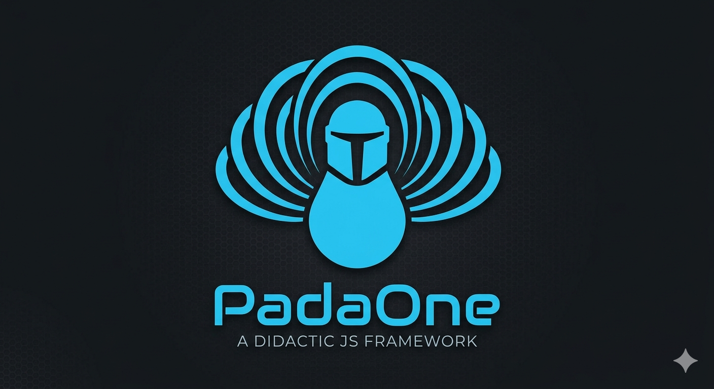

<div align="center">
  
  <h1>PadaOne</h1>
  <p>Un micro-framework didattico per scrivere Vanilla JS in modo strutturato.</p>
</div>

---

## Cos'è PadaOne?

PadaOne è un framework leggero scritto in JavaScript puro, pensato per chi sta imparando a sviluppare senza dipendenze esterne. Niente build tools, niente `npm install`: basta un singolo tag `<script>`.

Il nome è un chiaro omaggio a Star Wars.

---

## Installazione

Includi il file `padaone.js` nella tua pagina HTML, **prima** del tuo script applicativo:

```html
<script src="scripts/padaone.js"></script>
<script src="scripts/index.js"></script>
```

---

## API

### `PadaOne.compileTemplate(templateSelector, data)`

Clona un elemento `<template>` HTML e lo popola con i dati forniti. Restituisce un `DocumentFragment` pronto per essere inserito nel DOM.

| Parametro          | Tipo                                 | Descrizione                                              |
| ------------------ | ------------------------------------ | -------------------------------------------------------- |
| `templateSelector` | `string`                             | Selettore CSS del `<template>` (es. `'#post-template'`) |
| `data`             | `Record<string, string \| function>` | Oggetto `{ selettoreCSS: valore }` per popolare il template |

Il valore associato a ciascun selettore può essere:
- una **stringa** → viene assegnata a `src` (per ``) o a `textContent`
- una **funzione** `(el) => void` → riceve l'elemento e permette modifiche arbitrarie

**Esempio:**

```js
const postEl = PadaOne.compileTemplate('#post-template', {
    '.card-title': 'Il mio primo post',
    '.card-img-top': 'https://example.com/foto.jpg',
    '.card-text': 'Testo del post...',
    '.card': (el) => {
        el.dataset.action = 'showPost';
        el.dataset.actionJson = JSON.stringify({ id: 1 });
    },
});

document.querySelector('.container').appendChild(postEl);
```

---

### `PadaOne.delegateEvent(parent, eventType, targetSelector, callback)`

Registra un singolo listener sul `parent` che intercetta gli eventi generati dai discendenti che corrispondono a `targetSelector` (event delegation).

| Parametro        | Tipo                        | Descrizione                               |
| ---------------- | --------------------------- | ----------------------------------------- |
| `parent`         | `HTMLElement`               | Elemento su cui registrare il listener    |
| `eventType`      | `string`                    | Tipo di evento (es. `'click'`, `'input'`) |
| `targetSelector` | `string`                    | Selettore CSS degli elementi target       |
| `callback`       | `function(event, targetEl)` | Chiamata quando l'evento corrisponde      |

**Esempio:**

```js
PadaOne.delegateEvent(document.body, 'click', '.card', (event, cardEl) => {
    console.log('Card cliccata:', cardEl);
});
```

---

### `PadaOne.startActionEngine(actions)`

Avvia un sistema di azioni dichiarativo basato su attributi `data-action` e `data-action-json`. Ascolta i click sull'intera pagina e chiama la funzione corrispondente all'azione dichiarata nell'HTML.

| Parametro | Tipo                       | Descrizione                                         |
| --------- | -------------------------- | --------------------------------------------------- |
| `actions` | `Record<string, function>` | Mappa `{ nomeAzione: (elem, data, event) => void }` |

**HTML:**
```html
<div class="card"
     data-action="showPost"
     data-action-json='{"id": 1, "title": "Il mio post"}'>
  ...
</div>
```

**JavaScript:**
```js
const actions = {
    showPost: (elem, data, event) => {
        console.log('Post cliccato, ID:', data.id);
    }
};

PadaOne.startActionEngine(actions);
```

---

### `PadaOne.fetch(url)`

Wrapper attorno a `fetch()` con gestione automatica degli errori HTTP. Restituisce una `Promise` che si risolve con il JSON della risposta o rigetta con un errore descrittivo.

| Parametro | Tipo     | Descrizione     |
| --------- | -------- | --------------- |
| `url`     | `string` | URL da chiamare |

**Esempio:**

```js
PadaOne.fetch('https://jsonplaceholder.typicode.com/posts/1')
    .then(data => console.log(data))
    .catch(error => console.error(error));
```

---

## Struttura del progetto

```
js-padaone-framework/
├── index.html          # Pagina di esempio
├── imgs/
│   └── logo.png
├── scripts/
│   ├── padaone.js      # Il framework
│   └── index.js        # Codice applicativo di esempio
├── styles/
│   └── index.css
└── docs/
    ├── EventDelegation.md
    └── TemplateTag.md
```

---

## Concetti chiave

Per approfondire i pattern utilizzati nel framework:

- [Event Delegation](docs/EventDelegation.md) — come funziona il bubbling e `delegateEvent`
- [Il tag `<template>`](docs/TemplateTag.md) — come funziona `compileTemplate`
